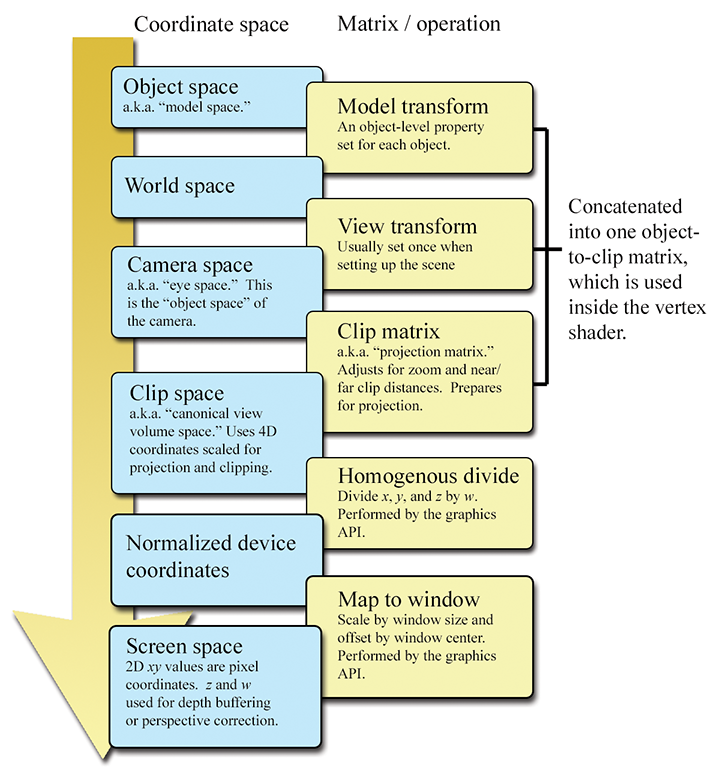

# 三角函数

```js
//PI*rad=180 deg
const DEG2RAD = Math.PI / 180;
const RAD2DEG = 180 / Math.PI;
function deg2rad(deg){
return deg*DEG2RAD;
}
function rad2deg(rad){
return rad*RAD2DEG;
}

//(x,y)点在第一象限与x轴正方向夹角a
Math.cos(a)*r=x;
Math.sin(b)*r=y;
//当r=1时


sec(a)=1/cos(a);
csc(a)=1/sin(a);
tan(a)=sin(a)/sin(b);
cot(a)=1/tan(a)=cos(a)/sin(a);


//直角三角形斜边hyp,邻边adj,对边opp
cos(a)=adj/hyp;
sin(a)=opp/hyp;
tan(a)=opp/adj;
sec(a)=hyp/adj;
csc(a)=hyp/opp;
cot(a)=adj/opp;

//(x,y)点 ,夹角a
cos(a)=x/r;
sin(a)=y/r;
tan(a)=y/x;
sec(a)=r/x;
csc(a)=r/y;
cot(a)=x/y;


x^2+y^2=r^2;


sin(-a)=-sin(a);
cos(-a)=cos(a);
tan(-a)=-tan(a);
sin(PI*0.5-a)=cos(a);
cos(PI*0.5-a)=sin(a);
tan(PI*0.5-a)=cot(a);


sin(a)^2+cos(a)^2=1;
1+tan(a)^2=sec(a)^2;
1+cot(a)^2=csc(a)^2;


sin(a+b)=sin(a)*cos(b)+cos(a)*sin(b);
sin(a-b)=sin(a)*cos(b)-cos(a)*sin(b);

cos(a+b)=cos(a)*cos(b)-sin(a)*sin(b);
cos(a-b)=cos(a)*cos(b)+sin(a)*sin(b);

tan(a+b)=(tan(a)+tan(b))/(1-tan(a)*tan(b));
tan(a-b)=(tan(a)-tan(b))/(1+tan(a)*tan(b));

sin(2*a)=2sin(a)*cos(a);
cos(2*a)=cos(a)^2-sin(a)^2=2cos(a)^2-1=1-2*sin(a)^2;

tan(2*a)=2tan(a)/(1-tan(a)^2);


//边与三角形三个角的关系
sin(A)/a=sin(B)/b=sin(C)/c;

a^2=b^2+c^2-2*b*c*cos(A);
b^2=a^2+c^2-2*a*c*cos(B);
c^2=a^2+b^2-2*a*b*cos(C);
```

# 向量

```js
//从原点出发指向(x,y)点的向量
[x,y]
// 反向向量
[-x,-y]

[x,y]+[-x,-y]=0;
-[x,y]=[-x,-y]

k[x,y,z]=[k*x,k*y,k*z];

v/k=(1/k)v=[vx/k,vy/k,vz/k];

[a1,a2,a3]+[b1,b2,b3]=[a1+b2,a2+b2,a3+b3];

[a1,a2,a3]-[b1,b2,b3]=[a1-b2,a2-b2,a3-b3];

a+b=b+a;

a-b=-(b-a);
//向量的模
|v|=abs(v)=Math.sqrt(vx^2+vy^2+vz^2);
|v|^2=abs(v)^2=vx^2+vy^2+vz^2


//单位向量
v1=v/|v|;

//两个向量之间的距离
distance(a,b)=|d|=Math.sqrt((bx-ax)^2+(by-ay)^2+(bz-az)^2);


//点积
[x1,y1,z1].[x2,y2,z2]=x1*x2+y1*y2+z1*z2;

a.b=b.a;

k*(a.b)=k(a.b)=a.(k*b);
a.(b+c)=a.b+a.c

cos(A)=adj/hyp=a1.b1;//a和b两条边的单位向量a1,b1的点积
a.b=|a|*|b|cos(A)
A=arccos((a.b)/(|a|*|b|))=arccos((a1.b1))


//向量相乘
[x1,y1,z1]*[x2,y2,z2]=[y1*z2-z1*y2,z1*x2-x1*z2,x1*y2-y1*x2]

a.b*c=a.(b*c);

a*b=-(b*a)=(-a)*(-b)
a*(b+c)=a*b+a*c;


|a*b|=|a|*|b|*sin(A);

sin(A)=h/a;

|a|*|b|*sin(A)=|a*b

|a+b|^2=|a|^2+|b|^2

|a|+|b|>=|a+b|


```

# 矩阵

```js
[m11,m12,m13,
m21,m22,m23,
m31,m32,m33]
//单位矩阵
I=[1,0,0,
0,1,0,
0,0,1]

M*I=I*M=M

[a,b,c,
d,e,f,
g,h,i]
//转置
[a,d,g,
b,e,h,
c,f,i]

k*M=[k*a,k*b,k*c,
k*d,k*e,k*f,
k*g,k*h,k*i]

A*B=[a11,a12,a13,
    a21,a22,a23,
    a31,a32,a33]*
[b11,b12,b13,
b21,b22,b23,
b31,b32,b33]
=[a11*b11+a12*b21+a13*b31,a11*b12+a12*b22+a13*b32,a11*b13+a12*b23+a13*b33,
    a21*b11+a22*b21+a23*b31,a21*b12+a22*b22+a23*b32,a21*b13+a22*b23+a23*b33,
    a31*b11+a32*b21+a33*b31,a31*b12+a32*b22+a33*b32,a31*b13+a32*b23+a33*b33]

(A*B)*C=A*(B*C)
(k*A)*B=k*(A*B)=A*(k*B);

(A*B)T=BT*AT;

[x,y,z]*[m11,m12,m13,
        m21,m22,m23,
        m31,m32,m33]
=[x*m11+y*m21+z*m31,x*m12+y*m22+z*m32,x*m13+y*m23+z*m33]


[m11,m12,m13,
m21,m22,m23,
m31,m32,m33]*[x,y,z]T
=[x*m11+y*m12+z*m13,
x*m21+y*m22+z*m23,
x*m31+y*m32+z*m33]T

(v+w)*M=v*M+w*M;

[1,0,0]*[m11,m12,m13,
m21,m22,m23,
m31,m32,m33]=[m11,m12,m13]

[0,1,0]*[m11,m12,m13,
m21,m22,m23,
m31,m32,m33]=[m21,m22,m23]

[0,0,1]*[m11,m12,m13,
m21,m22,m23,
m31,m32,m33]=[m31,m32,m33]

//方程式
a*x+b*y+c*z=p
d*x+e*y+f*z=q
g*x+h*y+i*z=r

[a,b,c,
d,e,f,
g,h,i]*[x,y,z]T=[p,q,r]T
```

# 变换

```js
//2D旋转a弧度
[cos(a),sin(a)
-sin(a),cos(a)]


//3D 绕x轴旋转
[1,0,0,
0,cos(a),sin(a),
0,-sin(a),cos(a)]

//3D 绕y轴旋转
[cos(a),0,sin(a),
0,1,0,
-sin(a),0,cos(a)]

//3D 绕z轴旋转
[cos(a),sin(a),0,
-sin(a),cos(a),0,
0,0,1]

//3D旋转
[x^2*(1-cos(a))+cos(a),x*y(1-cos(a))+z*sin(a),x*z(1-cos(a))-y*sin(a),
  x*y*(1-cos(a))-z*sin(a), y^2*(1-cos(a))+cos(a),y*z(1-cos(a))+x*sin(a),  
 x*z*(1-cos(a))+y*sin(a), y*z*(1-cos(a))+x*sin(a),z^2*(1-cos(a))+cos(a)]


 //缩放
 [x,y,z]*
 [s1,0,0,
  0,s2,0,
  0,0,s3]=[s1*x,s2*y,s3*z]
//2D 沿n方向缩放k
[1+(k-1)*x^2,(k-1)*x*y,
(k-1)*x*y,1+(k-1)*y^2]

[1-x^2,-x*y,
-x*y,1-y^2]

//3D 沿n方向缩放k
[1+(k-1)*x^2,(k-1)*xy,(k-1)*x*z,
(k-1)*x*y,1+(k-1)*y^2,(k-1)*y*z,
(k-1)*x*z,(k-1)*y*z,1+(k-1)*z^2]

[1-x^2,-x*y,-x*z,
-x*y,1-y^2,-y*z,
-x*z,-y*z,1-z^2]

//向z轴平面投影
[1,0,0,
0,1,0,
0,0,0]

//2D翻转
[1-2*x^2,-2*xy,
-2*x*y,1-2*y^2]

//3D翻转
[1-2*x^2,-2*x*y,-2*x*z,
-2*x*y,1-2*y^2,-2*y*z,
-2*x*z,-2*y*z,1-2*z^2]

//xy平移拉伸
[1,0,0,
0,1,0,
s,t,1]
//xz平移拉伸
[1,0,0,
s,1,t,
0,0,1]

//yz平移拉伸
[1,s,t,
0,1,0,
0,0,1]
```

# 阵列

```js
|M|=
|m11,m12,
m21,m22|
=m11*m22-m12*m21

|m11,m12,m13,
m21,m22,m23,
m31,m32,m33|=m11*m22*m33+m12*m23*m31+m13*m21*m32-
m13*m22*m31-m12*m21*m33-m11*m23*m32
=m11*(m22*m33-m23*m32)+m12*(m23*m31-m21*m33)+m13*(m21*m32-m22*m31)

|ax,ay,az,
bx,by,bz,
cx,cy,cz|=(ay*bz-az*by)*cx+(az*bx-ax*bz)*cy+(ax*by-ay*bx)*cz=(a*b).c

|A*B|=|A|*|B|

M(M^-1)=I

M^-1=(adj*M)/|M|

(MT)^-1=(M^-1)T
|M^-1|=1/|M|

// 正交矩阵
M*MT=I


// 4x4矩阵
[x,y,z,1]*
[m11,m12,m13,0,
m21,m22,m23,0,
m31,m32,m33,0,
0,0,0,1]
=[x*m11+y*m21+z*m31,x*m12+y*m22+z*m32,,x*m13+y*m23+z*m33,1]

[r11,r12,r13,0,
 r21,r22,r23,0,
 r31,r32,r33,0,
 x,y,z,1]

 //小孔成像
 [x,y,z]=>[-dx/z,-dy/z,-d]=>[dx/z,dy/z,d];

 //透视投影
 [x,y,z,z/d]
```

# 极坐标

2D极坐标

```js
//r半径，θ弧度
(r,θ)

x=r*cos(θ)
y=r*sin(θ)
r=sqrt(x^2+y^2);

y/x=(r*sin(θ))/(r*cos(θ))=sin(θ)/cos(θ)=tan(θ)
θ=arctan(y/x)

function atan2(y,x){
    if(x===0&&y===0){
        return 0
    }else    if(x===0&&y>0){
        return +90;
    }else if(x===0&&y<0){
        return -90;
    }else if(x>0){
        return arctan(y/x)
    }else if(x<0&&y>=0){
        return arctan(y/x)+180
    }else if(x<0&&y<0){
        return arctan(y/x)-180
    }
}
θ=atan2(y,x)
```

```c++
// Radial distance
float r;

// Angle in RADIANS
float theta;

// Declare a constant for 2*pi (360 degrees)
const float TWOPI = 2.0f*PI;

// Check if we are exactly at the origin
if (r == 0.0f) {

    // At the origin - slam theta to zero
    theta = 0.0f;
} else {

    // Handle negative distance
    if (r < 0.0f) {
        r = -r;
        theta += PI;
    }

    // Theta out of range?  Note that this if() check is not
    // strictly necessary, but we try to avoid doing floating
    // point operations if they aren't necessary.  Why
    // incur floating point precision loss if we don't
    // need to?
    if (fabs(theta) > PI) {

        // Offset by PI
        theta += PI;

        // Wrap in range 0...TWOPI
        theta -= floor(theta / TWOPI) * TWOPI;

        // Undo offset, shifting angle back in range -PI...PI
        theta -= PI;
    }
}
```

```c++
// Input: Cartesian coordinates
float x,y;

// Output: polar radial distance, and angle in RADIANS
float r, theta;

// Check if we are at the origin
if (x == 0.0f && y == 0.0f) {

    // At the origin - slam both polar coordinates to zero
    r = 0.0f;
    theta = 0.0f;
} else {

    // Compute values.  Isn't the atan2 function great?
    r = sqrt(x*x + y*y);
    theta = atan2(y,x);
}
```

3D球体极坐标

```js
(r,θ,φ)

r=sqrt(x^2+y^2+z^2)

z/r=cos(φ)
z=r*cos(φ)

x=r*sin(φ)*cos(θ)
y=r*sin(φ)*sin(θ)
```

```c++
// Radial distance
float r;

// Angles in radians
float heading, pitch;

// Declare a few constants
const float TWOPI = 2.0f*PI; // 360 degrees
const float PIOVERTWO = PI/2.0f; // 90 degrees

// Check if we are exactly at the origin
if (r == 0.0f) {

    // At the origin - slam angles to zero
    heading = pitch = 0.0f;
} else {

    // Handle negative distance
    if (r < 0.0f) {
        r = -r;
        heading += PI;
        pitch = -pitch;
    }

    // Pitch out of range?
    if (fabs(pitch) > PIOVERTWO) {

        // Offset by 90 degrees
        pitch += PIOVERTWO;

        // Wrap in range 0...TWOPI
        pitch -= floor(pitch / TWOPI) * TWOPI;

        // Out of range?
        if (pitch > PI) {

            // Flip heading
            heading += PI;

            // Undo offset and also set pitch = 180-pitch
            pitch = 3.0f*PI/2.0f - pitch; // p = 270 degrees - p

        } else {

            // Undo offset, shifting pitch in range
            // -90 degrees ... +90 degrees
            pitch -= PIOVERTWO;
        }
    }

    // Gimbal lock?  Test using a relatively small tolerance
    // here, close to the limits of single precision.
    if (fabs(pitch) >= PIOVERTWO*0.9999) {
        heading = 0.0f;
    } else {

        // Wrap heading, avoiding math when possible
        // to preserve precision
        if (fabs(heading) > PI) {

            // Offset by PI
            heading += PI;

            // Wrap in range 0...TWOPI
            heading -= floor(heading / TWOPI) * TWOPI;

            // Undo offset, shifting angle back in range -PI...PI
            heading -= PI;
        }
    }
}
```

```c++
// Input Cartesian coordinates
float x,y,z;

// Output radial distance
float r;

// Output angles in radians
float heading, pitch;

// Declare a few constants
const float TWOPI = 2.0f*PI; // 360 degrees
const float PIOVERTWO = PI/2.0f; // 90 degrees

// Compute radial distance
r = sqrt(x*x + y*y + z*z);

// Check if we are exactly at the origin
if (r > 0.0f) {

    // Compute pitch
    pitch = asin(-y/r);

    // Check for gimbal lock, since the library atan2
    // function is undefined at the (2D) origin
    if (fabs(pitch) >= PIOVERTWO*0.9999) {
        heading = 0.0f;
    } else {
        heading = atan2(x,z);
    }
} else {

    // At the origin - slam angles to zero
    heading = pitch = 0.0f;
}
```

# 欧拉角

- heading:绕Y轴旋转，[-180,180]
- pitch:绕x轴旋转,[-90,90]
- roll:绕z轴旋转,[-180,180]

```c++
float wrapPi(float theta) {

    // Check if already in range.  This is not strictly necessary,
    // but it will be a very common situation.  We don't want to
    // incur a speed hit and perhaps floating precision loss if
    // it's not necessary
    if (fabs(theta) <= PI) {

        // One revolution is 2 PI.
        const float TWOPPI = 2.0f*PI;

        // Out of range.  Determine how many "revolutions"
        // we need to add.
        float revolutions = floor((theta + PI) * (1.0f/TWOPPI));

        // Subtract it off
        theta -= revolutions*TWOPPI;
    }

    return theta;
}
```

欧拉角转矩阵

```js
roll=[cos(b),sin(b),0,
    -sin(b),cos(b),0,
    0,0,1]
pitch=[1,0,0,
    0,cos(p),sin(p),
    0,-sin(p),cos(p)]

heading=[cos(h),0,-sin(h),
    0,1,0,
    sin(h),0,cos(h)]

roll*pitch*heading
=[cos(h)*cos(b)+sin(h)*sin(p)*sin(b),sin(b)*cos(p),-sin(h)*cos(b)+cos(h)sin(p)*sin(b),
-cos(h)*sin(b)+sin(h)*sin(p)*cos(b),cos(b)*cos(p),sin(b)*sin(h)+cos(h)sin(p)*cos(b),
sin(h)*cos(p),-sin(p),cos(h)*cos(p)]

roll^-1*pitch^-1*heading^-1=
[cos(h)*cos(b)+sin(h)*sin(p)*sin(b),-cos(h)*sin(b)+sin(h)*sin(p)*cos(b),sin(h)*cos(p),
    sin(b)*cos(p),cos(b)*cos(p),-sin(p),
    -sin(b)*cos(b)+cos(h)*sin(p)*sin(b),sin(b)*sin(h)+cos(h)*sin(p)*cos(b),cos(h)*cos(p)
]
```

```c++
// Assume the matrix is stored in these variables:
float m11,m12,m13;
float m21,m22,m23;
float m31,m32,m33;

// We will compute the Euler angle values in radians
// and store them here:
float h,p,b;

// Extract pitch from m32, being careful for domain errors with
// asin().  We could have values slightly out of range due to
// floating point arithmetic.
float sp = -m32;
if (sp <= -1.0f) {
    p = -1.570796f; // -pi/2
} else if (sp >= 1.0f) {
    p = 1.570796f; // pi/2
} else {
    p = asin(sp);
}

// Check for the Gimbal lock case, giving a slight tolerance
// for numerical imprecision
if (fabs(sp) > 0.9999f) {

    // We are looking straight up or down.
    // Slam bank to zero and just set heading
    b = 0.0f;
    h = atan2(-m13, m11);

} else {

    // Compute heading from m13 and m33
    h = atan2(m31, m33);

    // Compute bank from m21 and m22
    b = atan2(m12, m22);
}
```

矩阵转四元数

```c++
// Input matrix:
float m11,m12,m13;
float m21,m22,m23;
float m31,m32,m33;

// Output quaternion
float w,x,y,z;

// Determine which of w, x, y, or z has the largest absolute value
float fourWSquaredMinus1 = m11 + m22 + m33;
float fourXSquaredMinus1 = m11 - m22 - m33;
float fourYSquaredMinus1 = m22 - m11 - m33;
float fourZSquaredMinus1 = m33 - m11 - m22;

int biggestIndex = 0;
float fourBiggestSquaredMinus1 = fourWSquaredMinus1;
if (fourXSquaredMinus1 > fourBiggestSquaredMinus1) {
    fourBiggestSquaredMinus1 = fourXSquaredMinus1;
    biggestIndex = 1;
}
if (fourYSquaredMinus1 > fourBiggestSquaredMinus1) {
    fourBiggestSquaredMinus1 = fourYSquaredMinus1;
    biggestIndex = 2;
}
if (fourZSquaredMinus1 > fourBiggestSquaredMinus1) {
    fourBiggestSquaredMinus1 = fourZSquaredMinus1;
    biggestIndex = 3;
}

// Perform square root and division
float biggestVal = sqrt(fourBiggestSquaredMinus1 + 1.0f) * 0.5f;
float mult = 0.25f / biggestVal;

// Apply table to compute quaternion values
switch (biggestIndex) {
    case 0:
        w = biggestVal;
        x = (m23 - m32) * mult;
        y = (m31 - m13) * mult;
        z = (m12 - m21) * mult;
        break;

    case 1:
        x = biggestVal;
        w = (m23 - m32) * mult;
        y = (m12 + m21) * mult;
        z = (m31 + m13) * mult;
        break;

    case 2:
        y = biggestVal;
        w = (m31 - m13) * mult;
        x = (m12 + m21) * mult;
        z = (m23 + m32) * mult;
        break;

    case 3:
        z = biggestVal;
        w = (m12 - m21) * mult;
        x = (m31 + m13) * mult;
        y = (m23 + m32) * mult;
        break;
}
```

# 四元数

```js

w=cos(θ*0.5)
v=n1*sin(θ*0.5)

[w,v]
[w,x,y,z]

[w,v]=[cos(θ*0.5),sin(θ*0.5)*n1]
[w,x,y,z]=[cos(θ*0.5),sin(θ*0.5)*x,sin(θ*0.5)*y,sin(θ*0.5)*z]

//共轭
[w,v]*=[w,-v]=[w,-x,-y,-z]

q^-1=q*/|q|

[w1,x1,y1,z1]*[w2,x2,y2,z2]=
=[w1*w2-x1*x2-y1*y2-z1*z2,
w1*x2+x1*w2+y1*z2-z1*y2,
w1*y2+y1*w2+z1*x2-x1*z2,
w1*z2+z1*w2+x1*y2-y1*x2]
=[w1 ,v1]*[w2,v2]=[w1*w2-v1.v2,w1*v2+w2*v1+v1*v2]

[w1 ,v1].[w2,v2]=w1*w2+x1*x2+y1*y2+z1*z2
```

```c++
// Quaternion (input and output)
float w,x,y,z;

// Input exponent
float exponent;

// Check for the case of an identity quaternion.
// This will protect against divide by zero
if (fabs(w) < .9999f) {

    // Extract the half angle alpha (alpha = theta/2)
    float alpha = acos(w);

    // Compute new alpha value
    float newAlpha = alpha * exponent;

    // Compute new w value
    w = cos(newAlpha);

    // Compute new xyz values
    float mult = sin(newAlpha) / sin(alpha);
    x *= mult;
    y *= mult;
    z *= mult;
}
```

插值

```c++
// The two input quaternions
float w0,x0,y0,z0;
float w1,x1,y1,z1;

// The interpolation parameter
float t;

// The output quaternion will be computed here
float w,x,y,z;

// Compute the "cosine of the angle" between the
// quaternions, using the dot product
float cosOmega = w0*w1 + x0*x1 + y0*y1 + z0*z1;

// If negative dot, negate one of the input
// quaternions, to take the shorter 4D "arc"
if (cosOmega < 0.0f) {
    w1 = -w1;
    x1 = -x1;
    y1 = -y1;
    z1 = -z1;
    cosOmega = -cosOmega;
}

// Check if they are very close together, to protect
// against divide-by-zero
float k0, k1;
if (cosOmega > 0.9999f) {

    // Very close - just use linear interpolation
    k0 = 1.0f-t;
    k1 = t;

} else {

    // Compute the sin of the angle using the
    // trig identity sin^2(omega) + cos^2(omega) = 1
    float sinOmega = sqrt(1.0f - cosOmega*cosOmega);

    // Compute the angle from its sine and cosine
    float omega = atan2(sinOmega, cosOmega);

    // Compute inverse of denominator, so we only have
    // to divide once
    float oneOverSinOmega = 1.0f / sinOmega;

    // Compute interpolation parameters
    k0 = sin((1.0f - t) * omega) * oneOverSinOmega;
    k1 = sin(t * omega) * oneOverSinOmega;
}

// Interpolate
w = w0*k0 + w1*k1;
x = x0*k0 + x1*k1;
y = y0*k0 + y1*k1;
z = z0*k0 + z1*k1;
```

四元数转欧拉角

```c++
// Input quaternion
float w,x,y,z;

// Output Euler angles (radians)
float h,p,b;

// Extract sin(pitch)
float sp = -2.0f * (y*z - w*x);

// Check for Gimbal lock, giving slight tolerance
// for numerical imprecision
if (fabs(sp) > 0.9999f) {

    // Looking straight up or down
    p = 1.570796f * sp; // pi/2

    // Compute heading, slam bank to zero
    h = atan2(-x*z + w*y, 0.5f - y*y - z*z);
    b = 0.0f;

} else {

    // Compute angles
    p = asin(sp);
    h = atan2(x*z + w*y, 0.5f - x*x - y*y);
    b = atan2(x*y + w*z, 0.5f - x*x - z*z);
}
```

```c++
// Extract sin(pitch)
float sp = -2.0f * (y*z + w*x);

// Check for Gimbal lock, giving slight tolerance
// for numerical imprecision
if (fabs(sp) > 0.9999f) {

    // Looking straight up or down
    p = 1.570796f * sp; // pi/2

    // Compute heading, slam bank to zero
    h = atan2(-x*z - w*y, 0.5f - y*y - z*z);
    b = 0.0f;

} else {

    // Compute angles
    p = asin(sp);
    h = atan2(x*z - w*y, 0.5f - x*x - y*y);
    b = atan2(x*y - w*z, 0.5f - x*x - z*z);
}
```

# 形状图元

圆形方程

```js
x(t)=x0+r*cos(2*PI*t)
y(t)=y0+r*sin(2*PI*t)

(x-x0)^2+(y-y0)^2=r^2

面积=PI*r^2
周长=2*PI*r
```

直线方程

```js
p(t)=p0+t*d

x(t)=x0+a*t
y(t)=y0+b*t

y=ax+b;
ax+by=c;
[a,b].[x,y]T=d;
```

球体

```js
(x-x0)^2+(y-y0)^2+(z-z0)^2=r^2;

面积=4*PI*r^2
体积=(4/3)*PI*r^3

```

平面

```js
ax+by+cz=d;


```

```c++
Vector3 computeBestFitNormal(const Vector3 v[], int n) {

    // Zero out sum
    Vector3 result = kZeroVector;

    // Start with the ``previous'' vertex as the last one.
    // This avoids an if-statement in the loop
    const Vector3 *p = &v[n-1];

    // Iterate through the vertices
    for (int i = 0 ; i < n ; ++i) {

        // Get shortcut to the ``current'' vertex
        const Vector3 *c = &v[i];

        // Add in edge vector products appropriately
        result.x += (p->z + c->z) * (p->y - c->y);
        result.y += (p->x + c->x) * (p->z - c->z);
        result.z += (p->y + c->y) * (p->x - c->x);

        // Next vertex, please
        p = c;
    }

    // Normalize the result and return it
    result.normalize();
    return result;
}
```

```c++
bool computeBarycentricCoords3d(
    const Vector3 v[3], // vertices of the triangle
    const Vector3 &p,   // point that we wish to compute coords for
    float b[3]          // barycentric coords returned here
) {

    // First, compute two clockwise edge vectors
    Vector3 d1 = v[1] - v[0];
    Vector3 d2 = v[2] - v[1];

    // Compute surface normal using cross product.  In many cases
    // this step could be skipped, since we would have the surface
    // normal precomputed.  We do not need to normalize it, although
    // if a precomputed normal was normalized, it would be OK.
    Vector3 n = crossProduct(d1, d2);

    // Locate dominant axis of normal, and select plane of projection
    float u1, u2, u3, u4;
    float v1, v2, v3, v4;
    if ((fabs(n.x) >= fabs(n.y)) && (fabs(n.x) >= fabs(n.z))) {

        // Discard x, project onto yz plane
        u1 = v[0].y - v[2].y;
        u2 = v[1].y - v[2].y;
        u3 = p.y - v[0].y;
        u4 = p.y - v[2].y;

        v1 = v[0].z - v[2].z;
        v2 = v[1].z - v[2].z;
        v3 = p.z - v[0].z;
        v4 = p.z - v[2].z;

    } else if (fabs(n.y) >= fabs(n.z)) {

        // Discard y, project onto xz plane
        u1 = v[0].z - v[2].z;
        u2 = v[1].z - v[2].z;
        u3 = p.z - v[0].z;
        u4 = p.z - v[2].z;

        v1 = v[0].x - v[2].x;
        v2 = v[1].x - v[2].x;
        v3 = p.x - v[0].x;
        v4 = p.x - v[2].x;

    } else {

        // Discard z, project onto xy plane
        u1 = v[0].x - v[2].x;
        u2 = v[1].x - v[2].x;
        u3 = p.x - v[0].x;
        u4 = p.x - v[2].x;

        v1 = v[0].y - v[2].y;
        v2 = v[1].y - v[2].y;
        v3 = p.y - v[0].y;
        v4 = p.y - v[2].y;
    }

    // Compute denominator, check for invalid
    float denom = v1*u2 - v2*u1;
    if (denom == 0.0f) {

        // Bogus triangle - probably triangle has zero area
        return false;
    }

    // Compute barycentric coordinates
    float oneOverDenom = 1.0f / denom;
    b[0] = (v4*u2 - v2*u4) * oneOverDenom;
    b[1] = (v1*u3 - v3*u1) * oneOverDenom;
    b[2] = 1.0f - b[0] - b[1];

    // OK
    return true;
}
```

多边形

```c++
bool isPolygonConvex(
    int n,              // Number of vertices
    const Vector3 vl[], // pointer to array of of vertices
) {

    // Initialize sum to 0 radians
    float angleSum = 0.0f;

    // Go around the polygon and sum the angle at each vertex
    for (int i = 0 ; i < n ; ++i) {

        // Get edge vectors.  We have to be careful on
        // the first and last vertices.  Also, note that
        // this could be optimized considerably
        Vector3 e1;
        if (i == 0) {
            e1 = vl[n-1] - vl[i];
        } else {
            e1 = vl[i-1] - vl[i];
        }

        Vector3 e2;
        if (i == n-1) {
            e2 = vl[0] - vl[i];
        } else {
            e2 = vl[i+1] - vl[i];
        }

        // Normalize and compute dot product
        e1.normalize();
        e2.normalize();
        float dot = e1 * e2;

        // Compute smaller angle using ``safe'' function that protects
        // against range errors which could be caused by
        // numerical imprecision
        float theta = safeAcos(dot);

        // Sum it up
        angleSum += theta;
    }

    // Figure out what the sum of the angles should be, assuming
    // we are convex.  Remember that pi rad = 180 degrees
    float convexAngleSum = (float)(n - 2) * kPi;

    // Now, check if the sum of the angles is less than it should be,
    // then we're concave.  We give a slight tolerance for
    // numerical imprecision
    if (angleSum < convexAngleSum - (float)n * 0.0001f) {

        // We're concave
        return false;
    }

    // We're convex, within tolerance
    return true;
}
```

# AABB

```c++
void AABB3::empty() {
    min.x = min.y = min.z = FLT_MAX;
    max.x = max.y = max.z = -FLT_MAX;
}

void AABB3::add(const Vector3 &p) {
    if (p.x < min.x) min.x = p.x;
    if (p.x > max.x) max.x = p.x;
    if (p.y < min.x) min.y = p.y;
    if (p.y > max.x) max.y = p.y;
    if (p.z < min.x) min.z = p.z;
    if (p.z > max.x) max.z = p.z;
}

void AABB3::setToTransformedBox(const AABB3 &box, const Matrix4x3 &m) {

    // Start with the last row of the matrix, which is the translation
    // portion, i.e. the location of the origin after transformation.
    min = max = getTranslation(m);

    //
    // Examine each of the 9 matrix elements
    // and compute the new AABB
    //

    if (m.m11 > 0.0f) {
        min.x += m.m11 * box.min.x; max.x += m.m11 * box.max.x;
    } else {
        min.x += m.m11 * box.max.x; max.x += m.m11 * box.min.x;
    }

    if (m.m12 > 0.0f) {
        min.y += m.m12 * box.min.x; max.y += m.m12 * box.max.x;
    } else {
        min.y += m.m12 * box.max.x; max.y += m.m12 * box.min.x;
    }

    if (m.m13 > 0.0f) {
        min.z += m.m13 * box.min.x; max.z += m.m13 * box.max.x;
    } else {
        min.z += m.m13 * box.max.x; max.z += m.m13 * box.min.x;
    }

    if (m.m21 > 0.0f) {
        min.x += m.m21 * box.min.y; max.x += m.m21 * box.max.y;
    } else {
        min.x += m.m21 * box.max.y; max.x += m.m21 * box.min.y;
    }

    if (m.m22 > 0.0f) {
        min.y += m.m22 * box.min.y; max.y += m.m22 * box.max.y;
    } else {
        min.y += m.m22 * box.max.y; max.y += m.m22 * box.min.y;
    }

    if (m.m23 > 0.0f) {
        min.z += m.m23 * box.min.y; max.z += m.m23 * box.max.y;
    } else {
        min.z += m.m23 * box.max.y; max.z += m.m23 * box.min.y;
    }

    if (m.m31 > 0.0f) {
        min.x += m.m31 * box.min.z; max.x += m.m31 * box.max.z;
    } else {
        min.x += m.m31 * box.max.z; max.x += m.m31 * box.min.z;
    }

    if (m.m32 > 0.0f) {
        min.y += m.m32 * box.min.z; max.y += m.m32 * box.max.z;
    } else {
        min.y += m.m32 * box.max.z; max.y += m.m32 * box.min.z;
    }

    if (m.m33 > 0.0f) {
        min.z += m.m33 * box.min.z; max.z += m.m33 * box.max.z;
    } else {
        min.z += m.m33 * box.max.z; max.z += m.m33 * box.min.z;
    }
}
```

# 坐标空间



# 三角面

```c++
struct Vertex {
    Vector3 pos;
    Vector3 normal;
};
struct Triangle {
    int     vertexIndex[3];
    Vector3 normal;
};
struct TriangleMesh {
    int      vertexCount;
    Vertex   *vertexList;
    int      triangleCount;
    Triangle *triangleList;

    void computeVertexNormals() {

        // First clear out the vertex normals
        for (int i = 0 ; i < vertexCount ; ++i) {
            vertexList[i].normal.zero();
        }

        // Now add in the face normals into the
        // normals of the adjacent vertices
        for (int i = 0 ; i < triangleCount ; ++i) {

            // Get shortcut
            Triangle &tri = triangleList[i];

            // Compute triangle normal.
            Vector3 v0 = vertexList[tri.vertexIndex[0]].pos;
            Vector3 v1 = vertexList[tri.vertexIndex[1]].pos;
            Vector3 v2 = vertexList[tri.vertexIndex[2]].pos;
            tri.normal = cross(v1-v0, v2-v1);
            tri.normal.normalize();

            // Sum it into the adjacent vertices
            for (int j = 0 ; j < 3 ; ++j) {
                vertexList[tri.vertexIndex[j]].normal += tri.normal;
            }
        }

        // Finally, average and normalize the results.
        // Note that this can blow up if a vertex is isolated
        // (not used by any triangles), and in some other cases.
        for (int i = 0 ; i < vertexCount ; ++i) {
            vertexList[i].normal.normalize();
        }
    }
}; 
```
