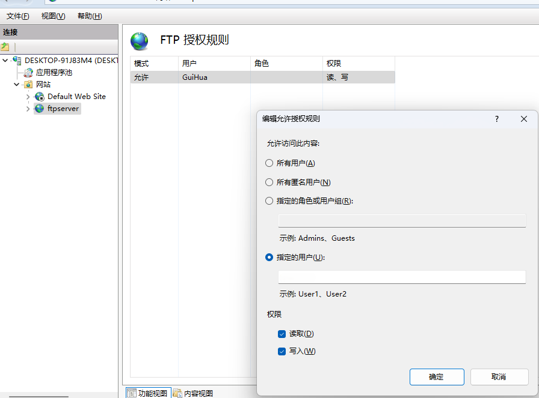
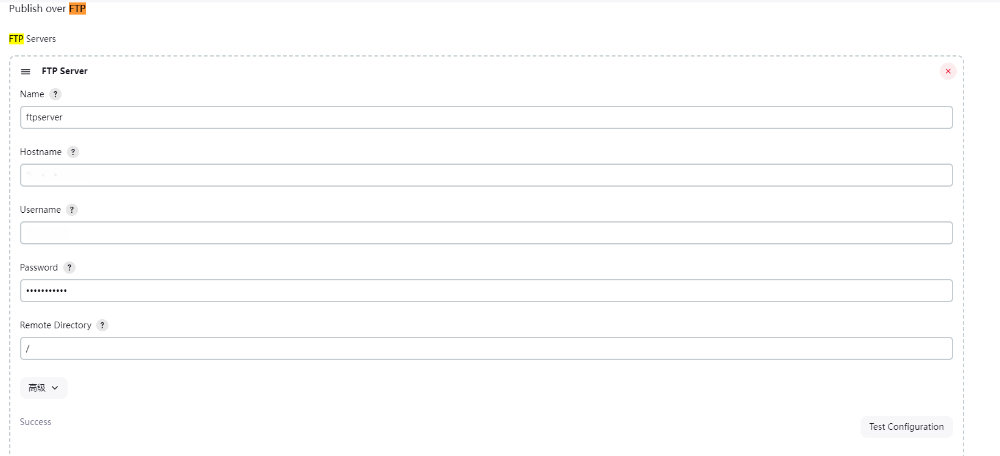
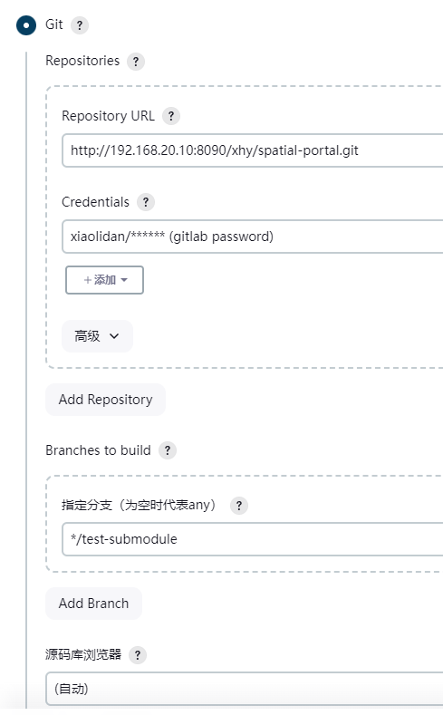
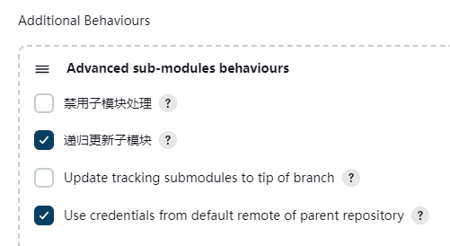
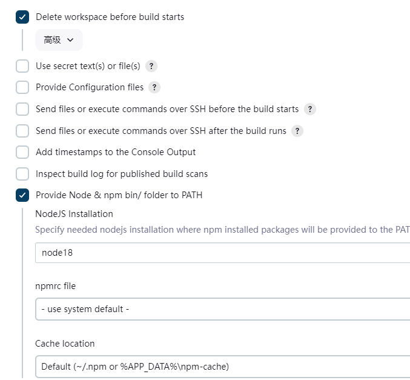
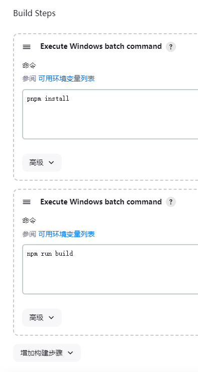
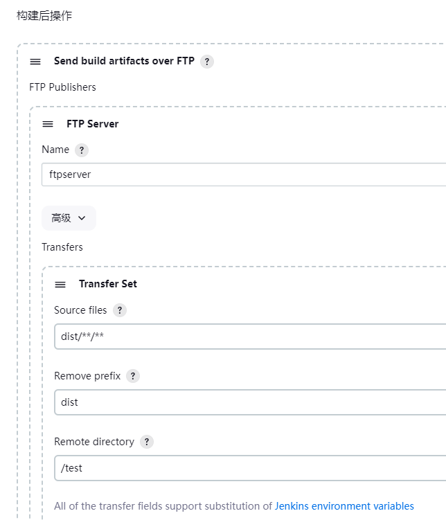

# 安装JDK21

配置JAVA_HOME

# 下载window版Jenkins

默认使用本地账户
初次登录打开密码复制粘贴到里面
默认推荐插件
安装GitLab插件，FTP插件
system配置git，node路径

# 配置ssh

```bash
ssh-keygen -t rsa -C "xiaolidan@126.com"
ssh-agent bash
ssh-add  ~/.ssh/gitlab_id_rsa
```

config

```ini
# gitlab
Host 192.168.20.10
HostName gitlab.com
PreferredAuthentications publickey
IdentityFile ~/.ssh/id_rsa
```

登录gitlab配置ssh

测试ssh是否成功

```bash
ssh -T git@192.168.20.10
```

# 配置ftp server

iis开启ftp,直接本机账号密码

system>ftp


# 配置部署item

凭证是gitlab账号密码

有子库添加submodule行为







# github

system>github server

凭证：secret text>git token(admin:org, admin:repo_hook, repo)

item中git配置的账号ssh私钥
