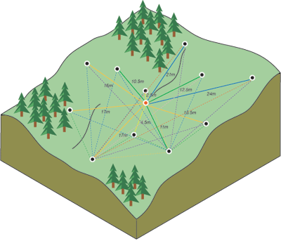
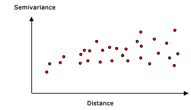
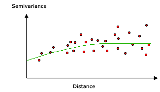
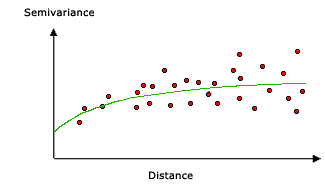
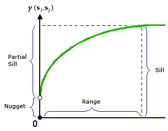
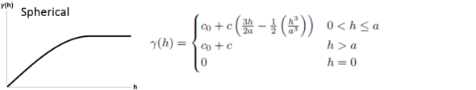
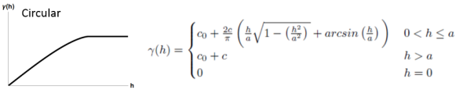
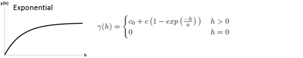
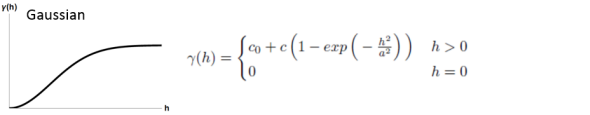
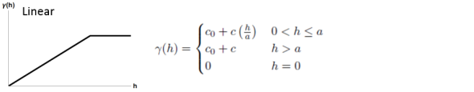

# kriging克里金的工作原理

https://doc.esri.com/en/arcgis-pro/latest/tool-reference/3d-analyst/how-kriging-works.html

## 什么是克里金？

IDW（逆距离加权）和 Spline 插值工具被称为确定性插值方法，因为它们直接基于周围的测量数据或指定的数学公式来确定结果表面的平滑度。另一类插值方法则是基于统计模型的地理统计方法，例如克里金法。这些统计模型考虑了测量点之间的统计关系，即自相关性。因此，地理统计技术不仅能生成预测表面，还能提供关于预测结果的准确性或可靠性的度量。

克里金法认为，样本点之间的距离或方向反映了空间相关性，这种相关性可以用来解释地表的变化规律。克里金法通过为指定的点数或指定半径内的所有点拟合数学函数，从而确定每个位置的输出值。这一过程包含多个步骤：首先对数据进行探索性统计分析，然后建立变量相关模型，接着生成地表模型，最后（可选）对变异表面进行进一步分析。当已知数据中存在空间相关的距离或方向偏差时，使用克里金法最为合适。该方法常用于土壤科学和地质学领域。

**加权距离的线性插值->加权距离地理空间强关联的线性插值**

## 克里金公式

克里金法与 IDW 法类似，都是通过对周围测量值进行加权处理，来估算出未知位置的数值。这两种插值方法的一般公式都是将数据加权求和得到的

```text
s0=a1*z(s1)+a2*z(s2)+……+ai*z(si)+……+an*z(sn)


```

- z(si):第i个位置的测量值
- ai:第i个位置的测得值的未知权重
- s0:预测位置
- n:测量值的数量

在IDW中，权重`ai`完全依赖于预测位置的距离。然而，在克里金法中，权重不仅基于测量点与预测位置之间的距离，还基于测量点的整体空间布局。为了在权重中使用空间排列，必须量化空间自相关。因此，在普通克里格中，权重`ai`取决于拟合模型与测量点、预测位置的距离以及预测位置周围测量值之间的空间关系。

在 IDW 方法中，权重`ai`仅取决于与预测位置的距离。而使用克里金法时，权重不仅基于测量点与预测位置之间的距离，还基于测量点在整个空间中的分布情况。为了将空间分布因素纳入权重计算，必须先对空间自相关进行量化处理。因此，在常规的克里金法中，权`ai`取决于对测量点的拟合模型、与预测位置的距离，以及预测位置周围测量值之间的空间关系。后续章节将讨论如何利用通用克里金公式来生成预测面的地图以及预测结果的精度图。

## 使用克里金法创建预测曲面图

要用克里金插值法进行预测，需要完成两个任务：

- 揭示依赖规则。

- 做出预测。

为了实现这两个任务，克里金通过两步流程：

- 该程序会生成变量统计量和协方差函数，以估算与自相关模型相关的统计依赖性（即空间自相关性）数值。

- 它能够预测那些未知的值（即做出预测）。

正是因为存在这双重任务，所以人们说克里金法实际上是两次使用数据：第一次用于估计数据的空间自相关性，第二次则用于做出预测。

## 变异法

在结构建模中，也被称为结构分析或变异分析。在对测量点的结构进行空间建模时，首先需要构建一个经验半变异函数的图形。该图形是通过以下方程来计算的，适用于所有相隔一定距离h 的位置对：

```text
S(distanceH)=0.5*avg((valuei-valuej)^2)
```

该公式涉及计算成对位置之间数值差的平方。

下图展示了其中一个点（红色点）与所有其他测量位置的配对情况。这个过程适用于每一个测量点。



通常，每对位置之间都存在独特的距离，而这样的点对有很多对。要快速绘制出所有点对，就会变得难以处理。因此，不如将这些点对分组到不同的间隔中。例如，可以计算所有距离超过 40 米但小于 50 米的点对的平均半方差。经验半方差图是一种图表，其中 y 轴表示平均半方差值，x 轴表示距离（或延迟）长度（见下图）。



空间自相关揭示了地理学中的一个基本现象：距离越近的地点之间的相似性越高，而距离越远的地点则差异越大。因此，在半变异函数图的 x 轴上位置越近的地点对，其数值应该越相似（在半变异函数图的 y 轴上位置越低）；而随着地点对之间的距离逐渐增大（在半变异函数图的 x 轴上向右移动），这些地点对之间的相似性会降低，且差异也会增大（在半变异函数图的 y 轴上位置上升）。

## 将模型拟合到经验半变异函数上

下一步是需要根据构成经验半变异函数的数据点来拟合一个模型。半变异函数建模是空间描述与空间预测之间的关键步骤。克里金法的主要应用就是用于在未采样位置预测属性值。经验半变异函数能够提供有关数据集空间自相关的信息，不过它并不能涵盖所有可能的方向和距离情况。因此，为了确保克里金法的预测结果具有正的克里金方差，就需要根据经验半变异函数来拟合一个模型——即一个连续的函数或曲线。从抽象上讲，这类似于回归分析，即根据数据点来拟合一条连续的线或曲线。

为了将模型拟合到实证半变异函数上，需要选择一个能够作为模型的函数——例如，一种在距离超过某个范围后逐渐趋于平稳的球形模型（参见下面的球形模型示例）。在实证半变异函数上，确实存在一些点与模型曲线不符的情况；有些点高于模型曲线，有些点低于模型曲线。然而，如果你计算每个点高于模型曲线的距离以及低于模型曲线的距离，这两个数值应该是相似的。有多种半变异函数模型可供选择。

## 半变异函数模型

Kriging 工具提供了多种功能，用户可以从中选择适合用于建模经验半变异函数的选项：

- Circular 圆形

- Spherical 球面

- Exponential 指数形式

- Gaussian 高斯函数

- Linear 线性

所选模型会影响对未知值的预测结果，尤其是在曲线在原点附近的形状存在显著差异时。曲线在原点附近越陡峭，最近的邻居对预测结果的影响就越大。因此，最终的输出表面将会不够平滑。每种模型都是为了更精确地描述不同类型的现象而设计的。

## 一个球形模型示例

该模型展示了空间自相关的逐渐降低趋势（相当于半变异性的增加），直到某个距离之外，此时自相关值变为零。球形模型是最常用的模型之一。



## 指数模型示例

当空间自相关性随着距离的增加而呈指数级下降时，就会使用这种模型。实际上，只有在无限大的距离时，自相关性才会完全消失。指数模型也是一种常用的模型。选择使用哪种模型取决于数据的空间自相关性以及我们对该现象的先验知识。



## 理解半变异函数——范围、基底和峰值

如前所述，半变异函数描述了测量点之间的空间自相关性。根据地理学的基本原理（即距离越近的事物越相似），相距较近的测量点其差异的平方通常会较小。当将每对位置数据进行分箱处理后，就可以对这些数据建立模型。常用的描述这些模型的指标包括范围、基尼系数和峰值。

### Range and sill范围和限度

当你观察半变异函数的模型时，会注意到在一定的距离范围内，模型的预测效果趋于平稳。模型开始趋于平稳的距离被称为“范围”。那些距离小于该范围的点之间的样本位置具有空间自相关性，而距离大于该范围的点则没有这种相关性。



半变异函数模型达到其范围值的点（即 y 轴上的数值）被称为基值。部分基值则是基值减去异常值。

### Nugget

从理论上来说，当分离距离为零时（例如，滞后值等于 0），半变异函数的数值为 0。然而，在极小的分离距离下，半变异函数通常会表现出一个“峰值效应”，即数值大于 0。如果半变异函数模型在 y 轴上截取点为 2，那么这个峰值就是 2。

“块效应”可能源于测量误差，或者由于空间变异源的影响，当距离小于采样间隔时就会出现这种效应（或者两者兼有）。测量误差是由于测量设备本身存在的误差所导致的。自然现象在多个尺度上都可能存在差异。当变异尺度小于采样距离时，这种差异就会表现为“块效应”的一部分。

## 做出预测

在确定了数据中是否存在依赖性或自相关性之后，当首次使用这些数据时——利用数据中的空间信息来计算距离并建模空间自相关性——你可以利用拟合模型进行预测。此后，就可以不再使用经验半变异函数了。

现在，你可以利用这些数据来进行预测。就像 IDW 插值法一样，克里金法也是从周围测量值中推导出权重，以预测那些尚未测量到的位置。与 IDW 插值法类似，那些与未测量位置最接近的测量值具有最大的影响力。不过，克里金法所确定的权重比 IDW 的权重更为复杂。IDW 使用的是基于距离的简单算法，而克里金法的权重则来自于对数据空间特性的分析。为了构建出连续的曲面，我们会根据半协方差函数以及附近测量值的空间分布，对研究区域内的每个位置或单元格中心进行预测。

## 克里金法

有两种克里金法：普通克里金法和通用克里金法。ordinary and universal.

普通克里金法是最通用且应用最广泛的克里金方法，因此被作为默认选择。该方法假设未知的是常数均值。除非有科学上的理由需要拒绝这一假设，否则这种假设是合理的。

通用克里金法假设数据中存在一种主导趋势，这种趋势可以通过确定性函数或多项式来建模。将多项式从原始测量数据中减去后，自相关现象就可以用随机误差来描述。在针对随机误差进行模型拟合之后，在做出预测之前，再将多项式加回预测结果中，从而得到有意义的结果。只有当你知道数据中存在某种趋势，并且能够为其提供科学上的解释时，才应使用通用克里金法。

## 半变异函数图

克里金法是一种复杂的建模方法，需要用户对空间统计学的深入理解才能运用。在采用克里金法之前，您必须充分掌握其基本原理，并评估数据是否适合用这种方法来进行建模。

克里金法基于区域化变量理论，该理论认为，由 z 值所表示的现象在空间上的变化在整个地形中是统计上均匀的（也就是说，地形上所有位置都呈现出相同的变化模式）。这种空间均匀性的假设是区域化变量理论的基础。

## 数学模型

以下是用于描述半方差的一般形式以及相关数学模型的方程。










